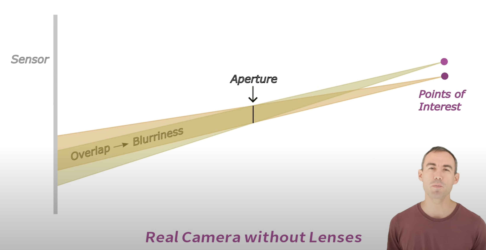
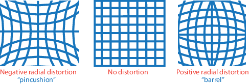
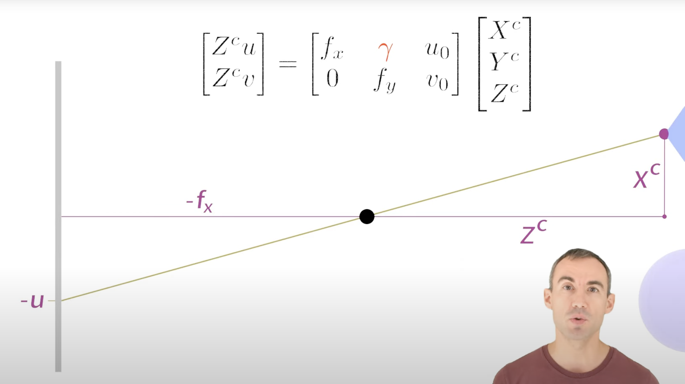
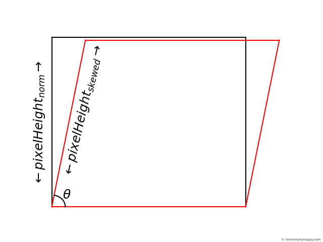

[TOC]

# Camera Model

## Real Camera

Aperture: 光圈

Lenses: prevent or reduce blurriness
- Introduce errors
    - radial distortion (pincusion distortion): causes straight lines to appear curved.
    - tangential distortion: occurs if the sensor is at an angle to the image plane. (影像平面与镜头光轴不平行造成的畸变)

## Pinhole Camera Model

Aperture = 0

**$\gamma$**: skew parameter, describe non-orthogonality of the image plane’s coordinate axes.

If the pixel x-direction and pixel y-direction are not perpendicular, then $\gamma$ measures the shear (skew).

$$
\gamma = f_x \cdot tan(\theta)
$$

## Camera Matrix

world coordinate -> pixel coordinate

$$
C = \begin{bmatrix}
f_x & \gamma & c_x \\
0 & f_y & c_y \\
0 & 0 & 1
\end{bmatrix} \cdot [R|t]
$$

$c_x, c_y$: principal point (optical center)

compared with above pinhole camera model (cartesian coordinates), here is in homogeneous coordinates [can represent infinity coordinates].

### Intrinsic Matrix

camera coordinate -> pixel coordinate
$$
\begin{bmatrix}
f_x & \gamma & c_x \\
0 & f_y & c_y \\
0 & 0 & 1
\end{bmatrix} \begin{bmatrix}
X^c \\
Y^c \\
Z^c
\end{bmatrix} = s \begin{bmatrix}
u \\
v \\
1
\end{bmatrix}
$$

$\gamma$ is shear of image plane

### Extrinsic Matrix

world coordinate -> camera coordinate
$$
\begin{bmatrix}
R & t \\
0 & 1
\end{bmatrix} \begin{bmatrix}
X^w \\
Y^w \\
Z^w \\
1
\end{bmatrix} = \begin{bmatrix}
X^c \\
Y^c \\
Z^c \\
1
\end{bmatrix}
$$

### Transformation

#### Special Orthogonal Group $SO(3)$

$$
SO(3)=\{R\in R^{3\times 3}|R^TR=I, det(R)=1\}
$$

#### Special Euclidean Group $SE(3)$

$$
SE(3) = \{(R,t)|R\in SO(3), t\in R^3\}
$$

#### Similarity Transfomation $Sim(3)$

$$
Sim(3)=\{sR|R\in SO(3), s>0\}
$$

- isotropic scale $s$ (在所有方向x,y,z上都按s比例缩放)

For 3D point x
$$
x'=sRx+t\\
T = 
\begin{bmatrix}
sR & t\\
0  & 1
\end{bmatrix}
$$

#### Special Linear Group SL(4)

$$
SL(4)=\{A\in R^{4\times4}|A^TA=I, det(A)=1\}
$$

For point x in homogeneous coordinate,
$$
x'=Ax
$$

- include scale, rotation, translation, *shear* and *projective transformation*.

##### Shear

$R^TR\neq I$, the shearing or not isotropic scaling
$$
A_{shear} = \begin{bmatrix}
1 & k_{xy} & k_{xz} & 0\\
k_{yx} & 1 & k_{yz} & 0\\
k_{zx} & k_{zy} & 1 & 0\\
0 & 0 & 0 & 1\\
\end{bmatrix}
$$
$k_{ij}$ is the shearing parameters

##### Projective distortion

$$
A_{shear} = \begin{bmatrix}
* & * & * & *\\
* & * & * & *\\
* & * & * & *\\
p_x & p_y & p_z & 1\\
\end{bmatrix}\\
w'=p_xx+p_yy+p_zz+1\\
x'=\frac{x}{w'}
$$

