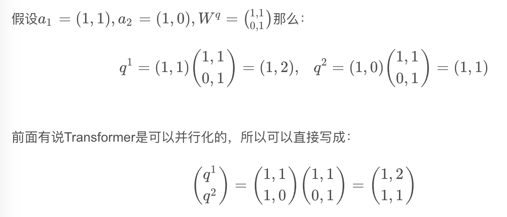
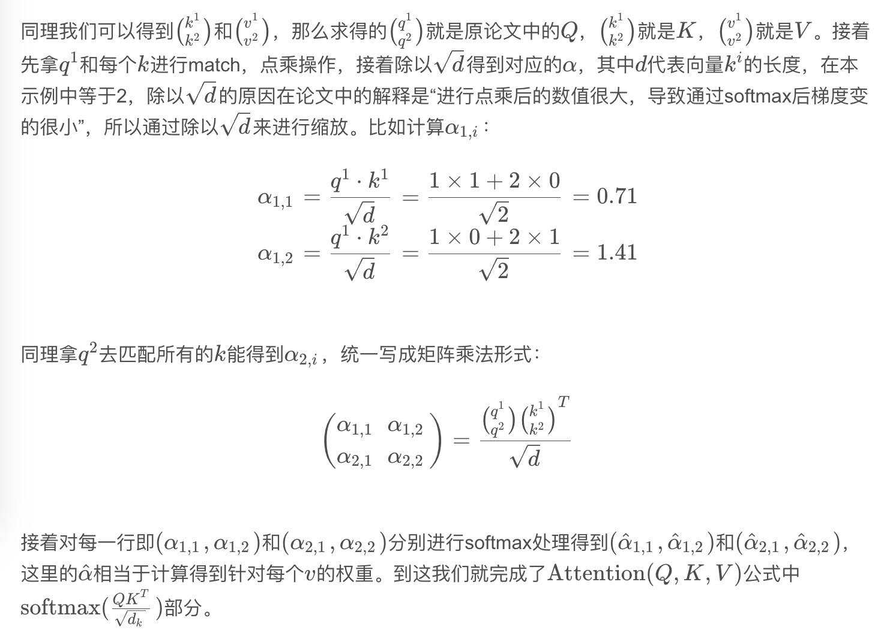
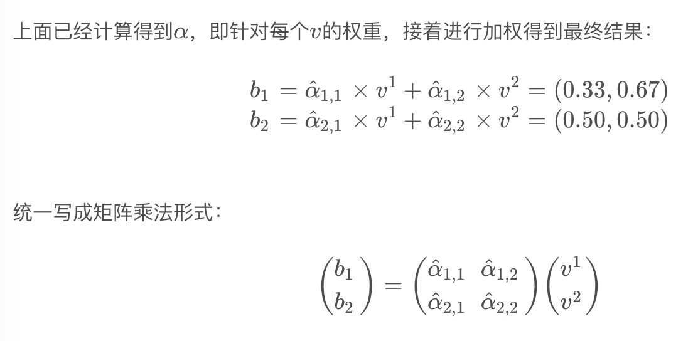

https://blog.csdn.net/qq_37541097/article/details/117691873

[TOC]

## Transformer's Self-attention and Multi-head attention

### Self-attention

1. $a^i = f(x^i)$
2. $q^i=a^iW^q$, $k^i, v^i$
3. softmax($\frac{QK^T}{\sqrt{d_k}}$)
4. b = weight sum of V multiply 3.

Input sequence length = 2;

Input node $x_1, x_2$;

Input embedding f(x): $f(x_1)=a_1$

Trainable, sharing parameters: $W_q, W_k, W_v$

- q: query，后续会去和每一个k进行匹配
- k: key，后续会被每个q匹配
- v: 从a中提取的信息
- q和k匹配理解作计算两者相关性，相关性越大，对应v的权重越大

***

$$
Attention(Q,K,V)=softmax(\frac{QK^T}{\sqrt{d_k}})V
$$

### Multi-Head Attention

1. $a^i = f(x^i)$
2. $q^{i,j}=a^iW_j^q$, $k^{i,j}, v^{i,j}$
3. Softmax

Multi-head attention allows the model to jointly attend to information from different representation subspaces at different positions.

跟self-attention一样将$a_i$通过$W_q, W_k, W_v$得到对应的$q^i,k^i,v^i$根据head数目h，把$q^i,k^i,v^i$均分成h份。

得到每个$head_i$对应的$Q_i, K_i, V_i$参数，得到
$$
Attention(Q_i,K_i,V_i)=softmax(\frac{Q_iK_i^T}{\sqrt{d_k}})V_i
$$

将每个head得到的结果进行concat，得到$b_{1,1}$ ($head_1$得到的$b_1$)与$b_{1,2}$ ($head_2$得到的$b_1$)拼接在一起

将拼接后的结果通过$W$进行融合，得到最终结果$b_1, b_2$

***

$$
MultiHead(Q,K,V) = Concat(head_1, ..., head_h)W^O\\
where\ head_i=Attention(QW_i^Q, KW_i^K, VW_i^V)
$$

### Self-attention and Multi-head attention 计算量对比

Due to the reduced dimension of each head, the total computational cost is similar to that of single-head attention with full dimensionality.

### Positional Encoding

位置编码$pe=\{pe_1,...,pe_n\}$是直接加在输入的$a=\{a_1,...,a_n\}$。关于位置编码在原论文中有提出两种方案，一种是原论文中使用的固定编码，即论文中给出的sine and cosine functions方法，按照该方法可计算出位置编码；另一种是可训练的位置编码，作者说尝试了两种方法发现结果差不多（但在ViT论文中使用的是可训练的位置编码）。

### Hyperparameters

- N: 重复堆叠Transformer Block的次数
- $d_{model}$：Multi-Head Self-Attention输入输出的token维度（向量长度）
- $d_{ff}$：MLP（feed forward）中隐层的节点个数
- $h$：Multi-Head Self-Attention中head的个数
- $d_k, d_v$：Multi-Head Self-Attention中每个head的key（K）以及query（Q）的维度
- $P_{drop}$：dropout层的drop_rate

### Padding Mask

自然语言数据往往都是以Batch的形式输入进的模型，而一个batch中的每一句话不能保证长度都是一样的，所以需要使用PADDING的方式将所有的句子都补全到最长的长度。

PADDING MASK在attention的计算过程中处于softmax之前，通过PADDING MASK的操作，使得补全位置上的值成为一个非常大的负数（可以是负无穷），这样的话，经过Softmax层的时候，这些位置上的概率就是0。

### Sequence Mask

Sequence Mask只在Decoder端进行,目的是为了使得decoder不能看见未来的信息.也就是对于一个序列中的第i个token,解码的时候只能够依靠i时刻之前(包括i)的的输出,而不能依赖于i时刻之后的输出.因此我们要采取一个遮盖的方法(Mask)使得其在计算self-attention的时候只用i个时刻之前的token进行计算,因为Decoder是用来做预测的,而在训练预测能力的时候,我们不能够"提前看答案",因此要将未来的信息给遮盖住。
