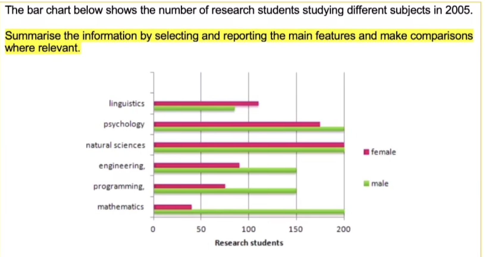
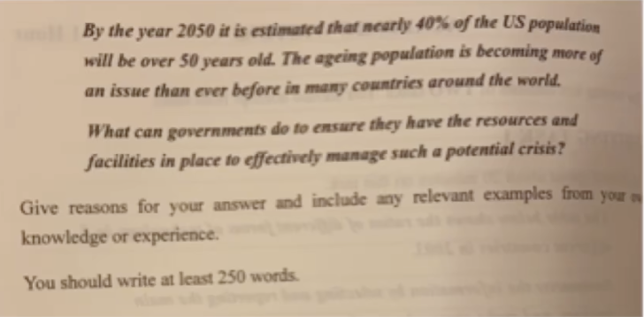

[TOC]

# Part1

### Overview

200-250字

四段：

- **Introduction**
- **Overview**
  - comparison
  - 2-3 key features, no speicifc data.
- **specific analysis1**：similar
- **specific analysis2**:  difference
  - always comparison
  - require specific data

### Saving

#### graph name

line graph：折线图

bar chart：分类直方图

histogram: 连续数字的直方图

pie chart：饼图

**使用过去式，大约**

#### 下行趋势

experience a downward trend

show a gradual decrease to

continue to decline steadily

reaching xxx in 2014 and hitting a low-point of about xxx in 2015.

fall to

#### 上行趋势

show a upward trend

rise to almost

experience a steady growth

increase by around

show a steady but significant rise over the period

experience a rapid surge

threefold increase to xxx *3

have a slight growth of xxx

soar

#### 来回摆动

have some fluctuations

remain steady for the next year

#### 对比

it outrace xxx at the end of the period.

surpass

xxx as opposed to xxx

xxx and xxx respectively

#### 数字description

one third

three times that of 

#### Pie chart

was the smallest segment = contributed the least to the economy = made the lowest contribution = made up the smallest part of the chart = was the least significant part of the economy

was the largest segment = contributed the most to the economy = made the highest contribution = made up the biggest part of the chart = was the most significant part of the economy

### Example

Overall, there were more male than female research students in the given year. Among all the subjects, male students had a higher enrollment than female students except for linguistics. Although both genders took a strong interest in psychology and natural sciences, two of the most popular subjects, men least preferred linguistics and women mathematics.

Female and male students showed a more or less similar interest in linguistics, psychology and natural sciences. In particular, natural sciences was the most popular of all, showing the same enrollment number of 200. Though very popular, psychology was favored more by men (200) than women (around 170). In linguistics, the situation was the reverse, with more women than men.

However, female and male students showed significant differences in engineering, programming and mathematics. In all three subjects, male dominance was obvious, espeicially in mathematics, which was taken by 200 male students and only around 40 female students. In engineering and programming, the number of female students was roughly half of that of male.

# Part 2

### Overview

270-320字

4段（2个主题

段落内部: point, elaboration, example, point

### 开头writing

#### Background

In the modern epoch, the issue of xxx has always been a matter of public interest.

#### 点题

- **Agree**: Some individual champion the notion that xxx.

- **Discuss**: Some individuals champion the notion that xxx, while a significant number of others posit that xxx.

- **现象**：it could be obvious witnessed a phenomenon that xxx.

#### 开门见山

- **Agree**: Despite recognizing the merits and drawbacks behind the viewpoint, I am inclined to support/oppose it.
- **Discuss**: Despite recognizing the validities of both sides, I am inclined to support the former/latter.
- **优缺点**: Despite recognizing the merits and drawbacks behind the phenomenon, I am inclined to believe it has more advantages/disadvantages.
- **2 tasks**: This essay aims to devlve into the analysis of the causes and potential influcences behind the phenomenon.

### Example

> [para 1]
>
> (1) neural statement to point out the background.
>
> (2) 1-2 zoom-in statments to paraphrase the topic
>
> (3) This essay will

The rapidly ageing demographic is posing an imminent threat to society. In the U.S, it is claimed that by 2050, the ageing population will have reached an unmanageable size, putting a strain on public resources and facilities. This essay will illustrate two ways in which the government can act in the face of the above problem.

> [para 2, 3]
>
> (1) use a paralleled topic sentence to start the paragraph;
>
> (2) follow point-elaboration-example-point

In response to **resources** issues, the government can actively explore the prospect of artificial intelligence (AI). one type of crisis of the ageing population is the shortage of hands, both in the gneral labour market and in the elderly care industry. It is inadequate for elderly people to partake in some strenuous and machanical work, such as cleaning and construction. However, with the use of AI, these kinds of repetitive work can be taken up, which frees up human resources for the more advanced work. AI can also be used in elderly care services. For example, it can help to gather biometric data from the elderly and assist them in simple tasks at home. In this way, the lack of human resources can be compensated, which ensures the efficient functioning of society.

In response to **facilities** issues, the government can reallocate the annual budget and invest more in social welfare support. With time, elderly people become more susceptible to diseases, and they definitely call for more medical attention. The government needs to make sure the elderly can get timely treatment in well-equipped placees. As such, the government should allocate enough money to building hospitals and elderly homes, which is important to address this future need.

In conclusion, the crisis brought by the ageing population must be tackled with care. Developing AI technologies and improving social welfare support will be a good way to start.

## vocabulary

scientific consensus and social reality 科学常识和社会现实

remedy n.解决方法; v.补救

arduous task 困难的任务

support the idea that

look down on/upon 轻视

utility 设施；公用设施；实用性

expenditure n. 花费

reasonable adj. 合理的

overuse water

crucial

sustainable global development

deficiency

scarcity

