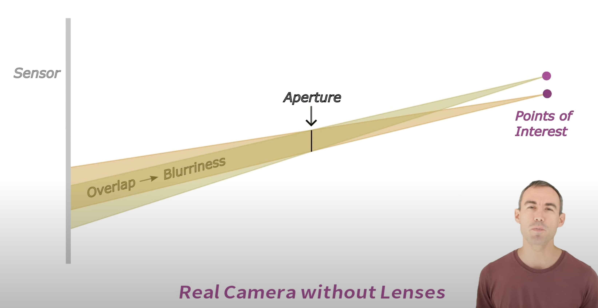
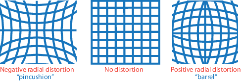
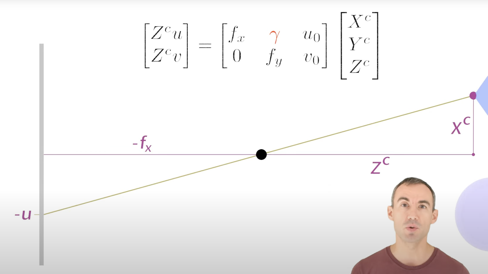
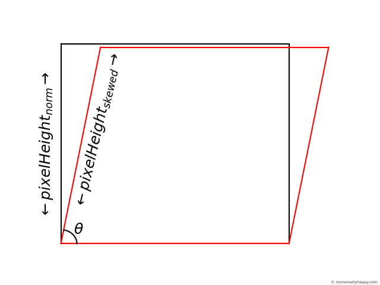

# Camera Model

## Real Camera

Aperture: 光圈

Lenses: prevent or reduce blurriness
- Introduce errors
    - radial distortion (pincusion distortion): causes straight lines to appear curved.
    - tangential distortion: occurs if the sensor is at an angle to the image plane. (影像平面与镜头光轴不平行造成的畸变)

## Pinhole Camera Model

Aperture = 0

**$\gamma$**: skew parameter, describe non-orthogonality of the image plane’s coordinate axes.

If the pixel x-direction and pixel y-direction are not perpendicular, then $\gamma$ measures the shear (skew).

$$
\gamma = f_x \cdot tan(\theta)
$$

## Camera Matrix

world coordinate -> pixel coordinate

$$
C = \begin{bmatrix}
f_x & \gamma & c_x \\
0 & f_y & c_y \\
0 & 0 & 1
\end{bmatrix} \cdot [R|t]
$$

$c_x, c_y$: principal point (optical center)

compared with above pinhole camera model (cartesian coordinates), here is in homogeneous coordinates [can represent infinity coordinates].

### Intrinsic Matrix

camera coordinate -> pixel coordinate
$$
\begin{bmatrix}
f_x & \gamma & c_x \\
0 & f_y & c_y \\
0 & 0 & 1
\end{bmatrix} \begin{bmatrix}
X^c \\
Y^c \\
Z^c
\end{bmatrix} = s \begin{bmatrix}
u \\
v \\
1
\end{bmatrix}
$$

$\gamma$ is shear of image plane

### Extrinsic Matrix

world coordinate -> camera coordinate
$$
\begin{bmatrix}
R & t \\
0 & 1
\end{bmatrix} \begin{bmatrix}
X^w \\
Y^w \\
Z^w \\
1
\end{bmatrix} = \begin{bmatrix}
X^c \\
Y^c \\
Z^c \\
1
\end{bmatrix}
$$