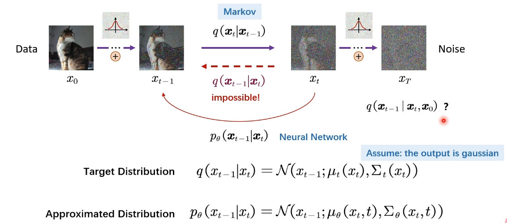
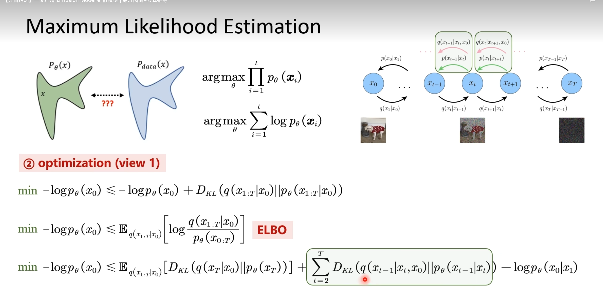
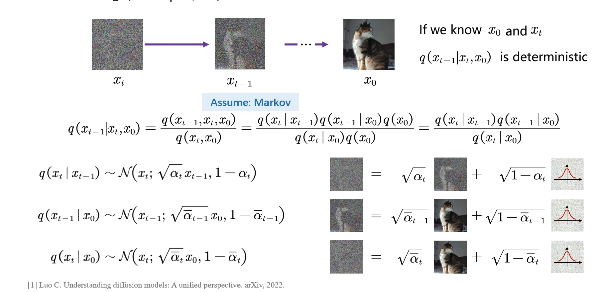
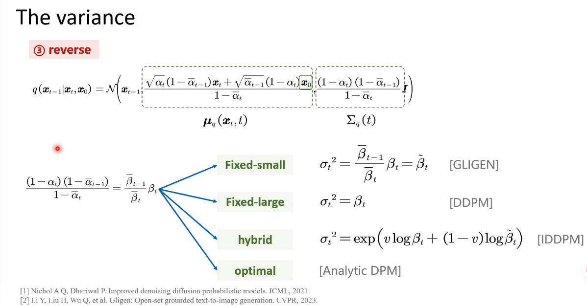
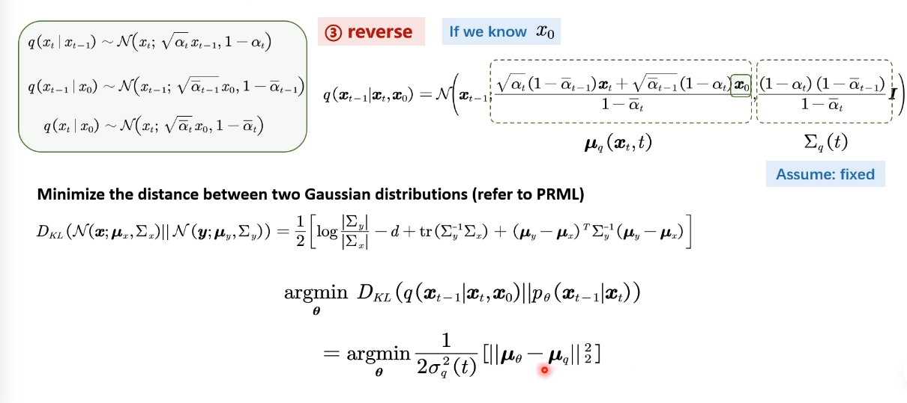
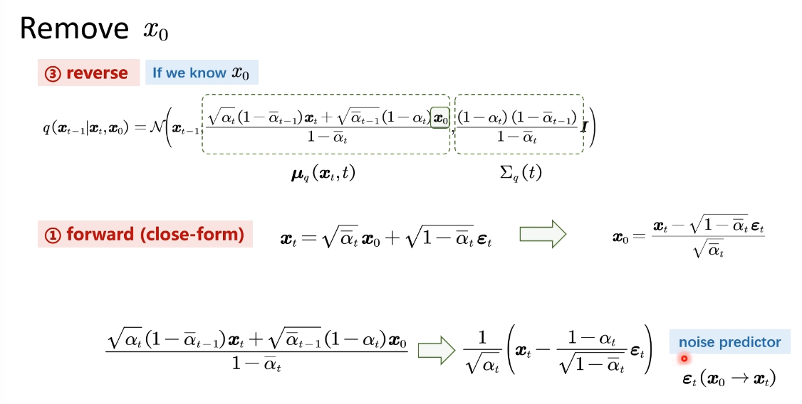
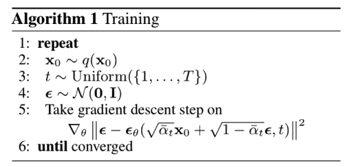
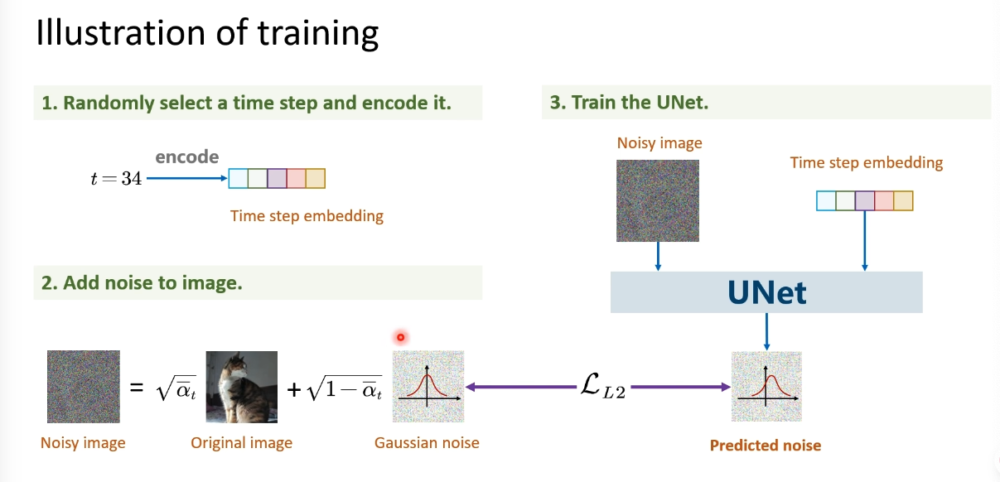
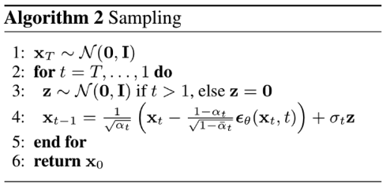
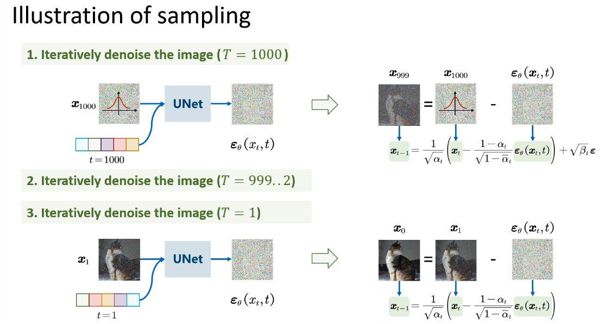

[TOC]

## Diffusion Model

### Forward Diffusion Process

信噪比和：信息占比减小，噪声占比增大；为了使得每一步加噪点效果比较一致
$$
x_t = \sqrt{\alpha_t}x_{t-1}+\sqrt{1-\alpha_t}\epsilon_{t-1}
$$

#### 1. Forward (close-form)

When X and Y are independent  and identically distributed (i.i.d)
$$
If\ \ X\sim \N(\mu_X,\sigma_X^2)\ \ Y\sim\N(\mu_Y,\sigma_Y^2))\ \ \\
Z = X+Y\\
Then\ Z\sim \N(\mu_X+\mu_Y,\sigma_X^2+\sigma_Y^2)
$$

> When X and Y are dependent
> $$
> Z=X+Y\sim\N(\mu_X+\mu_Y,\sigma_X^2+\sigma_Y^2+2\sigma_{XY})
> $$

可以得到
$$
x_t &=& \sqrt{\alpha_t}(\sqrt{\alpha_{t-1}}x_{t-2}+\sqrt{1-\alpha_{t-1}}\epsilon_{t-2})+\sqrt{1-\alpha_t}\epsilon_{t-1}\\
&=& \sqrt{\alpha_t\alpha_{t-1}}x_{t-2}+\sqrt{\alpha_t-\alpha_{t}\alpha_{t-1}}\epsilon_{t-2}+\sqrt{1-\alpha_t}\epsilon_{t-1}\\
&=& \sqrt{\alpha_t\alpha_{t-1}\cdots\alpha_1}x_{0}+\sqrt{1-\alpha_t\alpha_{t-1}\cdots\alpha_1}\epsilon\\
&=& \sqrt{\bar{\alpha}_t}x_0+\sqrt{1-\bar{\alpha}_t}\epsilon
$$
可以从$x_0$一步加噪到$x_t$

### Reverse Diffusion Process

 

#### 2. Optimization (Maximum Likelihood Estimation)

#### 3. Reverse: given $q(x_{t-1}|x_t, x_0)$

> The variance
>
> 

**Reverse**

**Remove $x_0$**

> Why not predict $x_0$ directly?
>
> 噪声不能很好的一步预测图像的生成，而是通过多次迭代扩散的过程，预估修正从而获得一个高性能的图。

#### 4. training

$$
argmin_{\theta} & \frac{1}{2\sigma_q^2(t)}[||\mu_\theta-\mu_q||_2^2]\\
argmin_\theta & \frac{1}{2\sigma_q^2(t)}\frac{(1-\alpha_t)^2}{(1-\bar{\alpha}_t)\alpha_t}[||\epsilon_t-\hat{\epsilon}_\theta(x_t,t)||_2^2]
$$

#### 5. sampling

$$
x_{t-1}=\frac{1}{\sqrt{\alpha_t}}\left(x_t-\frac{1-\alpha
_t}{\sqrt{1-\bar{\alpha}_t}}\epsilon_\theta(x_t, t)\right)+\sigma_tz
$$

