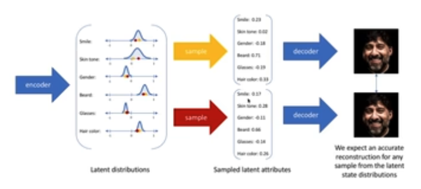

# Variational Autoencoer (VAE)

### Intuition

1. Classic autoencoder that learns a set of cmopressed latent attribtes.
2. Use probabilistic distribution to model attribte range variation.
3. We can sample latent attributes to generate different images

### Evidence Lower Bound (ELBO)

