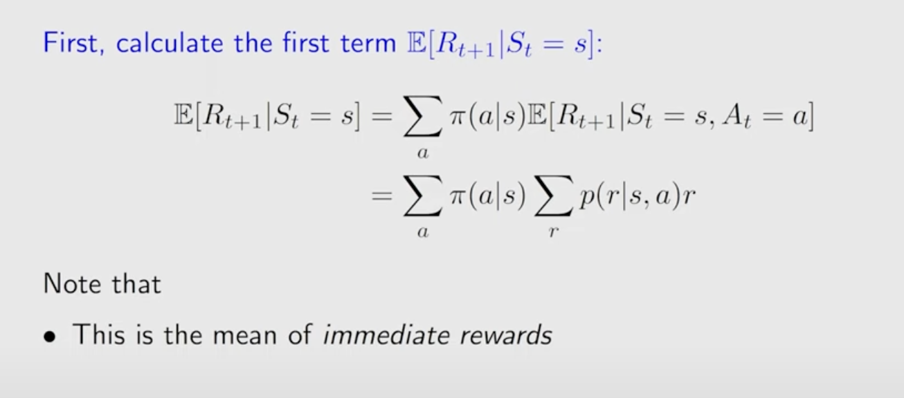

[TOC]

## ||||||||\\\\\\

## ]]e

## llman Equation: Derivation

 

![[image-20250907222055102]](./img/image-20250907222055102.png)
$$
v_\pi(s)=\sum_a\pi(a|s)\left[\sum_rp(r|s,a)+\gamma\sum_{s^\prime}p(s^{\prime}|s,a)v_\pi(s^{\prime})\right]
$$

## Bellman Equation: matrix-vector form

for $s\in S$, there are $|S|$ equations like $v_\pi(s)$.

Rewrite the Bellman equation as
$$
v_\pi(s)=r_\pi(s)+\gamma\sum_{s^{\prime}}p_\pi(s^{\prime}|s)v_\pi(s^{\prime})
$$
where
$$
r_\pi(s) &\cong& \sum_a\pi(a|s)\sum_rp(r|s,a)r\\
p_\pi(s^{\prime}|s) &\cong& \pi(a|s)p(s^{\prime}|s,a)
$$

Suppose the states could be indexed as $s_i (i=1,\cdots,n)$

The Bellman equation rewrite to a matrix-vecotr form
$$
v_\pi=r_\pi+\gamma P_\pi v_\pi
$$
where

### The closed-form solution to state values is

$$
v_\pi=(I-\gamma P_\pi)^{-1}r_\pi
$$

(avoid the matrix inverse operation) An iterative solution is 
$$
v_{k+1}=r_\pi+\gamma P_\pi v_k
$$

$$
v_k\rightarrow v_\pi=(I-\gamma P_\pi)^{-1}r_\pi,\ k\rightarrow \infin
$$
